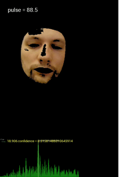

# Facial Heart Rate Detection 

## 1. Idea 

ML models are learning from us how to do things for us. For example, page relevance evaluation in search engines.

But what really is fascinating is when it looks farther than us, does things that we can’t.

There are many cameras around us. What if we can **measure the heart rate in real time just by observing a person**. We can prevent a dangerous condition, give fitness advice, play music with beat that matches heart beat or it can simply act as a new mean of health monitoring.

The capillaries on the face are filled with blood every beat of heart. Camera can detect the pulse by a very slight change in the color of the skin. The effective amplitude is often about 0.2 of the minimum color gradation recorded by the camera (i.e Red goes from 178.3 to 178.5). Therefore, any external interference with a slight tilt of the head or a trembling hand with the phone, a slight lighting change - ruin the whole picture.

I’ve just released an application that measures HR using facial camera.
 
 

 The frame goes through 8 processors before we can obtain person’s heart rate. These processors can mitigate external factors to some extent, but the current implementation based on OpenCV is not accurate enough to allow a person to move around in a frame.

**I want to use ML Kit to allow a person to move in the frame more freely using face contour detection to provide accurate measurements.** I also plan to add new processors that can isolate external factors better using TensorFlow.

## 2.Plan 

### What do I have

At the moment I have an application that allow to detect heart rate filming face (OpenCV) and proof of concept ML Kit application.
Main app is not published in the most countries yet. It’s far from ideal , but it has *4,878* overall rating at the moment. Please watch the demonstration videos.

#### Main app

It can detect heart rate by face ± 3 bpm (~ 50% confidence), ± 6 bpm (~ 65% confidence) in the following conditions:

* there’s very little movement in the frame,
* the face is well lit.

It can measure heart rate in less stable conditions with lesser confidence.

_You can watch video comparison with hardware Polar strap. Take a look at `actual-app-demo.mp4`_

##### Features

* shows heart rate and confidence to user (not just bare bpm).
* charts, measurement lists etc.

#### Proof of concept ML Kit app
It can detect heart rate in a static frame as well as the main application does. Shows much better confidence when face is moving than prior application.

_You can watch video comparison with hardware Polar strap. Take a look at `ml-kit-proof-of-concept-demo.mp4`_

Pay attention to the bottom part. There is a probability of any given frequency from 0 to 3 hz (180 bpm). Confidence score assigned to current measurement painted in yellow. 

You can see some movement in a frame and a marker trying to disrupt measurement. Filters managed to hold.

Not all Main app processors were used in this app.

### How google can help.
#### TLDR

- Help with MLKit optimizations

- Share an expertise in TensorFlow modeling

- Share advice and ideas of further accuracy improvement

#### Performance 

The main application supports older phones starting with android 5. They have poor performance, so I had to work hard on optimizations:

- multithreading

- lower allocation rate

- render script and native (OpenCV) processors

- removing slow signal processors

- hack to perform slow graphical operations at 60 fps

ML Kit works fine on hi-end devices, but it works very slow on older (1 face contour detection per second). Now I’m experimenting with Frame Interpolator to compensate low detection rate, but so far there is not enough performance.

## Timeline

_December 1 - December 7, 2019_

- find a way to perform pulse detection using MlKit on low tier devices

_December 8 - December 21, 2019_

- migrate main app to new architecture to simplify further development

- replace OpenCV with MLKit (at the least for high performance devices)

_December 22, 2019 - January 1, 2020_

- closed testing and tuning.

_January 2 - January 14, 2020_

- app publication, gathering user feedback, fixing bugs and logic errors

_January 15, 2020 - January 30, 2020_

- creating testing framework to compare different plugin sets automatically. It’ll allow to determine which combination to use and if the newest plugin improving confidence or not. Testing different combinations

_March 1, - March 21 2020_

- collecting training data and testing models using TensorFlow to improve confidence further

_March 22 - March 30, 2020_

- publish to users, fix logic errors and bugs

_April 1, - May 1, 2020_

- finalising model training, spare time

## 3. Tell us about you

Hello. I’m a developer.

I’ve been working for 8 years. I like to solve beautiful algorithmic problems. Completed Foobar challenge. Like to know how things are working internally.

I used different languages, but the main one is Java.

